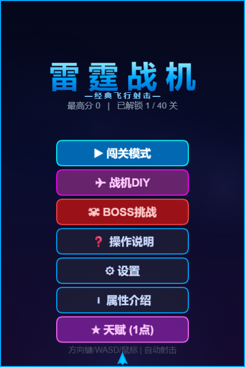
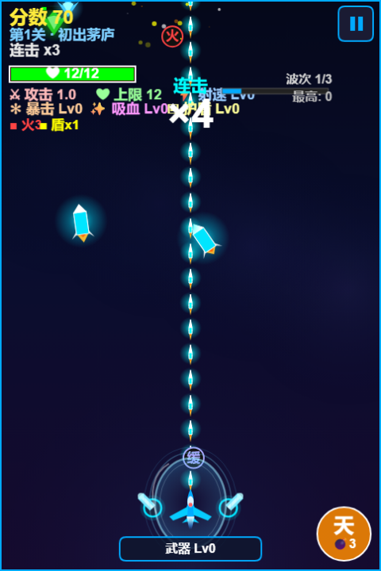
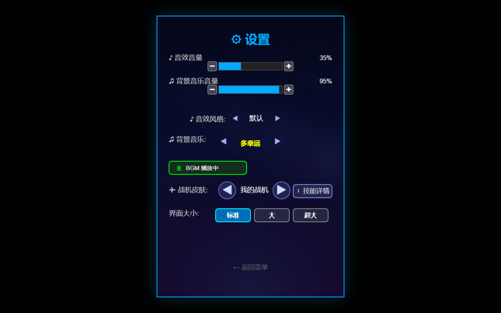
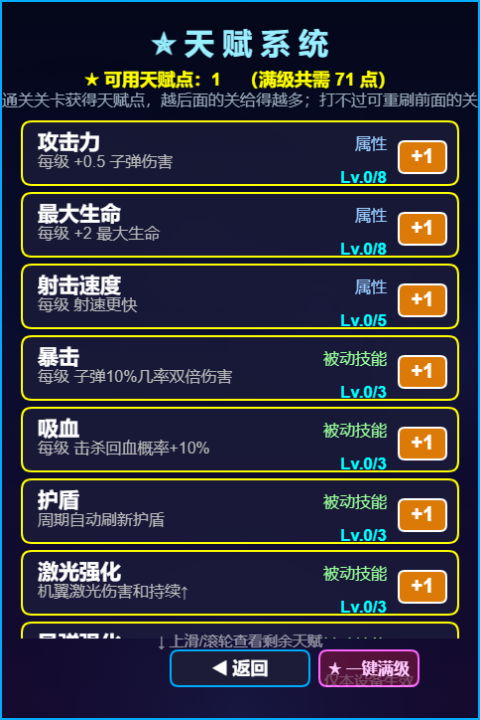
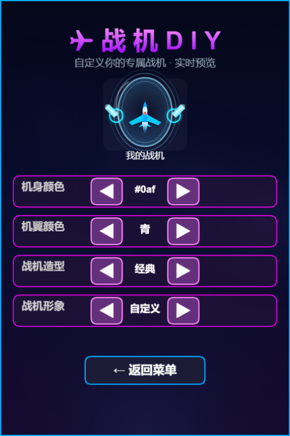
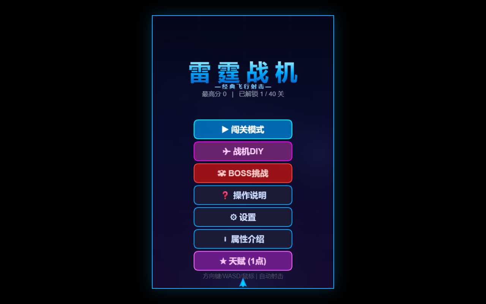

# 雷霆战机

一款基于 HTML5 Canvas 的网页版飞行射击游戏，致敬经典街机射击玩法。


## 在线游玩

直接打开 `index.html` 即可游玩，或访问已部署的线上地址。


## 游戏截图

| 主菜单 | 闯关战斗 | 大 Boss 战 |
| --- | --- | --- |
|  |  |  |

| 天赋系统 | 皮肤 DIY | 关卡选择 |
| --- | --- | --- |
|  |  |  |
## 游戏模式

| 模式 | 说明 |
|------|------|
| **闯关模式** | 经典关卡推进（共 40 关），主菜单支持选关，每关结束面对大 Boss |
| **大 Boss 挑战（Boss Rush）** | 跳过小兵，连续挑战大 Boss，记录最高分 |

> 注：当前版本仅以上两种战斗模式。早期版本曾规划「双人 / 无尽」玩法，相关代码已从游戏中彻底移除，主菜单亦无对应入口，故不列入正式模式。

## 操作方式

### 单人模式
| 操作 | 方式 |
|------|------|
| 移动 | 鼠标移动 / 触屏拖动 |
| 射击 | 自动射击 |
| 必杀技 | 点击屏幕右下角技能按钮 |
| 炸弹 | 点击屏幕右上角炸弹按钮 |

## 核心系统

### 天赋系统
在关卡之间可消耗天赋点升级，共 14 项天赋：

**被动天赋**
- 火力强化 — 子弹数量与伤害↑
- 导弹强化 — 追踪导弹数量和伤害↑
- 护盾强化 — 护盾数量↑
- 移速强化 — 移动速度↑
- 技能冷却缩减 — 每级 -15% 所有技能冷却
- 技能威力提升 — 每级 +20% 技能伤害

**主动必杀技（★）**
- ★星爆脉冲 — 环形冲击波清弹+击退
- ★量子分身 — 召唤 AI 分身自动射击
- ★引力黑洞 — 吸引敌人并爆炸
- ★维度斩 — 全屏斩击巨额伤害

### 连击系统
连续击杀敌人累积连击数，每 5 连击 +10% 伤害（最多 +50%），连击中断归零。

### 拾取道具
击败敌人或开启空投随机获得（显示为机身上方掉落的小图标）：

| 图标 | 名称 | 效果 |
|------|------|------|
| 散 | 散射 | 散射等级 +1，子弹更多 |
| 导 | 追踪导弹 | 增加追踪导弹 |
| 火 | 火力 | 提升子弹威力 |
| 回 | 回血 | 恢复生命值 |
| 盾 | 护盾 | 补充护盾层数 |
| 缓 | 减速 | 敌方子弹减速一段时间 |
| 追 | 自动追踪 | 子弹自动追踪敌人一段时间 |
| **清屏** | 清屏 | 清除全屏敌弹，危急时刻解围保命（已取代原先的「机尾后射」设计） |
| 倍 | 双倍得分 | 一段时间内得分翻倍 |

此外还有 **空投补给箱**：随机开出散射 / 回血 / 护盾 / 减速 / 自动追踪 / 清屏 等强力效果。

### 皮肤系统
内置多款战机皮肤，每款皮肤附带专属技能：
- 蓝翼 / 赤焰 / 黄金（预设）
- 鼠鼠 / 公主 / 听泉 / 奶龙 / 坤 / 雨姐（网红皮肤）
- DIY 自定义皮肤

## 音效系统

游戏使用 Web Audio API 实时合成音效，无需外部音频文件：

| 音效 | 触发场景 |
|------|----------|
| 射击 | 玩家开火 |
| 敌人受击 | 击中敌人 |
| 击杀（小/中/大） | 不同体型敌人被消灭 |
| Boss 击杀 | 大 Boss 倒下 |
| 受击（子弹/激光/Boss弹幕/撞击） | 按攻击类型区分 |
| 道具拾取 | 获得强化道具 |
| 关卡完成 | 通关 |
| 游戏结束 | 阵亡 |
| 必杀技释放 | 使用主动技能 |
| 护盾充能 | 护盾恢复 |

支持音效包切换：**复古 / 现代 / 标准** 三种风格。

**背景音乐**：内置多首循环 BGM，每次进入游戏会**随机选一首作为开场曲**，播完自动顺接下一首，听感更有新鲜感。可在设置中切换指定曲目、调节 BGM 音量或一键静音。

## 技术特点

- **纯前端实现** — 单文件 HTML，零构建、零依赖
- **自适应分辨率** — 支持桌面端与移动端，自动适配屏幕比例
- **Web Audio API** — 实时合成所有音效与背景音乐
- **Web Speech API** — Boss 登场语音播报
- **Canvas 2D 渲染** — 高性能粒子特效与弹幕系统
- **本地存档** — 进度、天赋、皮肤通过 localStorage 自动保存

## 文件结构

```
雷霆战机/
├── index.html      # 游戏主文件（全部代码）
├── _package.py     # 打包工具脚本
├── .gitignore      # Git 忽略规则
└── README.md       # 本文件
```

## 本地运行

直接用浏览器打开 `index.html` 即可，无需任何服务器或构建工具。

## License

MIT
